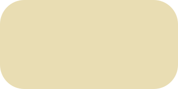

    <picture>
        <source media="(prefers-color-scheme: dark)" srcset="https://raw.githubusercontent.com/perpetuatheme/perpetua/main/logo/logo_circle_dark.png">
        <source media="(prefers-color-scheme: light)" srcset="https://raw.githubusercontent.com/perpetuatheme/perpetua/main/logo/logo_circle_light.png">
        
    </picture>
    <h1 align="center">Perpetua</h1>

Lightness-calibrated, unique natural hues for the tireless artisan

    <picture>
        <source media="(prefers-color-scheme: dark)" srcset="https://raw.githubusercontent.com/perpetuatheme/perpetua/main/assets/palette_dark.png">
        <source media="(prefers-color-scheme: light)" srcset="https://raw.githubusercontent.com/perpetuatheme/perpetua/main/assets/palette_light.png">
        
    </picture>

> [!WARNING]
> The project is under active development. Things are subject to change.

## Palettes

    
Light

    <table>
        <thead>
            <tr>
                <th>Swatch</th>
                <th>Label</th>
                <th>Hex</th>
                <th>RGB</th>
                <th>Okhsl (approx.)</th>
            </tr>
        </thead>
        <tbody>
            <tr>
                <td align="center"></td>
                <td>Red</td>
                <td><code>#dd0c25</code></td>
                <td><code>rgb(221, 12, 37)</code></td>
                <td><code>okhsl(25, 99%, 50%)</code></td>
            </tr>
            <tr>
                <td align="center"></td>
                <td>Orange</td>
                <td><code>#af6001</code></td>
                <td><code>rgb(175, 96, 1)</code></td>
                <td><code>okhsl(59, 99%, 50%)</code></td>
            </tr>
            <tr>
                <td align="center"></td>
                <td>Yellow</td>
                <td><code>#8e7502</code></td>
                <td><code>rgb(142, 117, 2)</code></td>
                <td><code>okhsl(93, 99%, 50%)</code></td>
            </tr>
            <tr>
                <td align="center"></td>
                <td>Lime</td>
                <td><code>#5a8705</code></td>
                <td><code>rgb(90, 135, 5)</code></td>
                <td><code>okhsl(129, 99%, 50%)</code></td>
            </tr>
            <tr>
                <td align="center"></td>
                <td>Green</td>
                <td><code>#068c65</code></td>
                <td><code>rgb(6, 140, 101)</code></td>
                <td><code>okhsl(165, 99%, 50%)</code></td>
            </tr>
            <tr>
                <td align="center"></td>
                <td>Turquoise</td>
                <td><code>#038981</code></td>
                <td><code>rgb(3, 137, 129)</code></td>
                <td><code>okhsl(187, 99%, 50%)</code></td>
            </tr>
            <tr>
                <td align="center"></td>
                <td>Cyan</td>
                <td><code>#028696</code></td>
                <td><code>rgb(2, 134, 150)</code></td>
                <td><code>okhsl(209, 99%, 50%)</code></td>
            </tr>
            <tr>
                <td align="center"></td>
                <td>Cerulean</td>
                <td><code>#0282ae</code></td>
                <td><code>rgb(2, 130, 174)</code></td>
                <td><code>okhsl(231, 99%, 50%)</code></td>
            </tr>
            <tr>
                <td align="center"></td>
                <td>Blue</td>
                <td><code>#0476db</code></td>
                <td><code>rgb(4, 118, 219)</code></td>
                <td><code>okhsl(254, 99%, 50%)</code></td>
            </tr>
            <tr>
                <td align="center"></td>
                <td>Violet</td>
                <td><code>#764bfe</code></td>
                <td><code>rgb(118, 75, 254)</code></td>
                <td><code>okhsl(287, 99%, 50%)</code></td>
            </tr>
            <tr>
                <td align="center"></td>
                <td>Lavender</td>
                <td><code>#b607d7</code></td>
                <td><code>rgb(182, 7, 215)</code></td>
                <td><code>okhsl(319, 99%, 50%)</code></td>
            </tr>
            <tr>
                <td align="center"></td>
                <td>Pink</td>
                <td><code>#d30384</code></td>
                <td><code>rgb(211, 3, 132)</code></td>
                <td><code>okhsl(352, 99%, 50%)</code></td>
            </tr>
            <tr>
                <td align="center"></td>
                <td>Red Back</td>
                <td><code>#f2d5d2</code></td>
                <td><code>rgb(242, 213, 210)</code></td>
                <td><code>okhsl(25, 51%, 88%)</code></td>
            </tr>
            <tr>
                <td align="center"></td>
                <td>Orange Back</td>
                <td><code>#f1d8c4</code></td>
                <td><code>rgb(241, 216, 196)</code></td>
                <td><code>okhsl(59, 51%, 88%)</code></td>
            </tr>
            <tr>
                <td align="center"></td>
                <td>Yellow Back</td>
                <td><code>#e9ddb3</code></td>
                <td><code>rgb(233, 221, 179)</code></td>
                <td><code>okhsl(93, 51%, 88%)</code></td>
            </tr>
            <tr>
                <td align="center"></td>
                <td>Lime Back</td>
                <td><code>#cfe6b8</code></td>
                <td><code>rgb(207, 230, 184)</code></td>
                <td><code>okhsl(129, 51%, 88%)</code></td>
            </tr>
            <tr>
                <td align="center"></td>
                <td>Green Back</td>
                <td><code>#b9ead3</code></td>
                <td><code>rgb(185, 234, 211)</code></td>
                <td><code>okhsl(165, 51%, 88%)</code></td>
            </tr>
            <tr>
                <td align="center"></td>
                <td>Turquoise Back</td>
                <td><code>#b5e9e3</code></td>
                <td><code>rgb(181, 233, 227)</code></td>
                <td><code>okhsl(187, 51%, 88%)</code></td>
            </tr>
            <tr>
                <td align="center"></td>
                <td>Cyan Back</td>
                <td><code>#bbe6ee</code></td>
                <td><code>rgb(187, 230, 238)</code></td>
                <td><code>okhsl(209, 51%, 88%)</code></td>
            </tr>
            <tr>
                <td align="center"></td>
                <td>Cerulean Back</td>
                <td><code>#c5e2f2</code></td>
                <td><code>rgb(197, 226, 242)</code></td>
                <td><code>okhsl(231, 51%, 88%)</code></td>
            </tr>
            <tr>
                <td align="center"></td>
                <td>Blue Back</td>
                <td><code>#cfdff3</code></td>
                <td><code>rgb(207, 223, 243)</code></td>
                <td><code>okhsl(254, 51%, 88%)</code></td>
            </tr>
            <tr>
                <td align="center"></td>
                <td>Violet Back</td>
                <td><code>#dbdaf3</code></td>
                <td><code>rgb(219, 218, 243)</code></td>
                <td><code>okhsl(287, 51%, 88%)</code></td>
            </tr>
            <tr>
                <td align="center"></td>
                <td>Lavender Back</td>
                <td><code>#e9d5ee</code></td>
                <td><code>rgb(233, 213, 238)</code></td>
                <td><code>okhsl(319, 51%, 88%)</code></td>
            </tr>
            <tr>
                <td align="center"></td>
                <td>Pink Back</td>
                <td><code>#f1d4df</code></td>
                <td><code>rgb(241, 212, 223)</code></td>
                <td><code>okhsl(352, 51%, 88%)</code></td>
            </tr>
            <tr>
                <td align="center"></td>
                <td>Base 0</td>
                <td><code>#f5f3f1</code></td>
                <td><code>rgb(245, 243, 241)</code></td>
                <td><code>okhsl(68, 12%, 96%)</code></td>
            </tr>
            <tr>
                <td align="center"></td>
                <td>Base 1</td>
                <td><code>#edeae7</code></td>
                <td><code>rgb(237, 234, 231)</code></td>
                <td><code>okhsl(68, 11%, 93%)</code></td>
            </tr>
            <tr>
                <td align="center"></td>
                <td>Base 2</td>
                <td><code>#e6e2de</code></td>
                <td><code>rgb(230, 226, 222)</code></td>
                <td><code>okhsl(68, 10%, 90%)</code></td>
            </tr>
            <tr>
                <td align="center"></td>
                <td>Base 3</td>
                <td><code>#d6d1cb</code></td>
                <td><code>rgb(214, 209, 203)</code></td>
                <td><code>okhsl(68, 9%, 84%)</code></td>
            </tr>
            <tr>
                <td align="center"></td>
                <td>Base 4</td>
                <td><code>#c6c0ba</code></td>
                <td><code>rgb(198, 192, 186)</code></td>
                <td><code>okhsl(68, 8%, 78%)</code></td>
            </tr>
            <tr>
                <td align="center"></td>
                <td>Base 5</td>
                <td><code>#b6b0a9</code></td>
                <td><code>rgb(182, 176, 169)</code></td>
                <td><code>okhsl(68, 7%, 72%)</code></td>
            </tr>
            <tr>
                <td align="center"></td>
                <td>Over 0</td>
                <td><code>#a5a09a</code></td>
                <td><code>rgb(165, 160, 154)</code></td>
                <td><code>okhsl(68, 6%, 66%)</code></td>
            </tr>
            <tr>
                <td align="center"></td>
                <td>Over 1</td>
                <td><code>#95908b</code></td>
                <td><code>rgb(149, 144, 139)</code></td>
                <td><code>okhsl(68, 5%, 60%)</code></td>
            </tr>
            <tr>
                <td align="center"></td>
                <td>Over 2</td>
                <td><code>#84817c</code></td>
                <td><code>rgb(132, 129, 124)</code></td>
                <td><code>okhsl(68, 4%, 54%)</code></td>
            </tr>
            <tr>
                <td align="center"></td>
                <td>Text 0</td>
                <td><code>#4d4d4c</code></td>
                <td><code>rgb(77, 77, 76)</code></td>
                <td><code>okhsl(68, 1%, 33%)</code></td>
            </tr>
            <tr>
                <td align="center"></td>
                <td>Text 1</td>
                <td><code>#5f5e5c</code></td>
                <td><code>rgb(95, 94, 92)</code></td>
                <td><code>okhsl(68, 2%, 40%)</code></td>
            </tr>
            <tr>
                <td align="center"></td>
                <td>Text 2</td>
                <td><code>#726f6c</code></td>
                <td><code>rgb(114, 111, 108)</code></td>
                <td><code>okhsl(68, 3%, 47%)</code></td>
            </tr>
        </tbody>
    </table>

    
Dark

    <table>
        <thead>
            <tr>
                <th>Swatch</th>
                <th>Label</th>
                <th>Hex</th>
                <th>RGB</th>
                <th>Okhsl (approx.)</th>
            </tr>
        </thead>
        <tbody>
            <tr>
                <td align="center"></td>
                <td>Red</td>
                <td><code>#ff9d94</code></td>
                <td><code>rgb(255, 157, 148)</code></td>
                <td><code>okhsl(25, 100%, 76%)</code></td>
            </tr>
            <tr>
                <td align="center"></td>
                <td>Orange</td>
                <td><code>#ffa353</code></td>
                <td><code>rgb(255, 163, 83)</code></td>
                <td><code>okhsl(59, 100%, 76%)</code></td>
            </tr>
            <tr>
                <td align="center"></td>
                <td>Yellow</td>
                <td><code>#dfb800</code></td>
                <td><code>rgb(223, 184, 0)</code></td>
                <td><code>okhsl(93, 100%, 76%)</code></td>
            </tr>
            <tr>
                <td align="center"></td>
                <td>Lime</td>
                <td><code>#90d400</code></td>
                <td><code>rgb(144, 212, 0)</code></td>
                <td><code>okhsl(129, 100%, 76%)</code></td>
            </tr>
            <tr>
                <td align="center"></td>
                <td>Green</td>
                <td><code>#00dca0</code></td>
                <td><code>rgb(0, 220, 160)</code></td>
                <td><code>okhsl(165, 100%, 76%)</code></td>
            </tr>
            <tr>
                <td align="center"></td>
                <td>Turquoise</td>
                <td><code>#00d8cb</code></td>
                <td><code>rgb(0, 216, 203)</code></td>
                <td><code>okhsl(187, 100%, 76%)</code></td>
            </tr>
            <tr>
                <td align="center"></td>
                <td>Cyan</td>
                <td><code>#00d3eb</code></td>
                <td><code>rgb(0, 211, 235)</code></td>
                <td><code>okhsl(209, 100%, 76%)</code></td>
            </tr>
            <tr>
                <td align="center"></td>
                <td>Cerulean</td>
                <td><code>#56caff</code></td>
                <td><code>rgb(86, 202, 255)</code></td>
                <td><code>okhsl(231, 100%, 76%)</code></td>
            </tr>
            <tr>
                <td align="center"></td>
                <td>Blue</td>
                <td><code>#8bbfff</code></td>
                <td><code>rgb(139, 191, 255)</code></td>
                <td><code>okhsl(254, 100%, 76%)</code></td>
            </tr>
            <tr>
                <td align="center"></td>
                <td>Violet</td>
                <td><code>#b6b1ff</code></td>
                <td><code>rgb(182, 177, 255)</code></td>
                <td><code>okhsl(287, 100%, 76%)</code></td>
            </tr>
            <tr>
                <td align="center"></td>
                <td>Lavender</td>
                <td><code>#ea95ff</code></td>
                <td><code>rgb(234, 149, 255)</code></td>
                <td><code>okhsl(319, 100%, 76%)</code></td>
            </tr>
            <tr>
                <td align="center"></td>
                <td>Pink</td>
                <td><code>#ff95c4</code></td>
                <td><code>rgb(255, 149, 196)</code></td>
                <td><code>okhsl(352, 100%, 76%)</code></td>
            </tr>
            <tr>
                <td align="center"></td>
                <td>Red Back</td>
                <td><code>#960d18</code></td>
                <td><code>rgb(150, 13, 24)</code></td>
                <td><code>okhsl(25, 97%, 34%)</code></td>
            </tr>
            <tr>
                <td align="center"></td>
                <td>Orange Back</td>
                <td><code>#763f02</code></td>
                <td><code>rgb(118, 63, 2)</code></td>
                <td><code>okhsl(59, 97%, 34%)</code></td>
            </tr>
            <tr>
                <td align="center"></td>
                <td>Yellow Back</td>
                <td><code>#5f4e03</code></td>
                <td><code>rgb(95, 78, 3)</code></td>
                <td><code>okhsl(93, 97%, 34%)</code></td>
            </tr>
            <tr>
                <td align="center"></td>
                <td>Lime Back</td>
                <td><code>#3c5a07</code></td>
                <td><code>rgb(60, 90, 7)</code></td>
                <td><code>okhsl(129, 97%, 34%)</code></td>
            </tr>
            <tr>
                <td align="center"></td>
                <td>Green Back</td>
                <td><code>#085e43</code></td>
                <td><code>rgb(8, 94, 67)</code></td>
                <td><code>okhsl(165, 97%, 34%)</code></td>
            </tr>
            <tr>
                <td align="center"></td>
                <td>Turquoise Back</td>
                <td><code>#045c56</code></td>
                <td><code>rgb(4, 92, 86)</code></td>
                <td><code>okhsl(187, 97%, 34%)</code></td>
            </tr>
            <tr>
                <td align="center"></td>
                <td>Cyan Back</td>
                <td><code>#035a65</code></td>
                <td><code>rgb(3, 90, 101)</code></td>
                <td><code>okhsl(209, 97%, 34%)</code></td>
            </tr>
            <tr>
                <td align="center"></td>
                <td>Cerulean Back</td>
                <td><code>#035776</code></td>
                <td><code>rgb(3, 87, 118)</code></td>
                <td><code>okhsl(231, 97%, 34%)</code></td>
            </tr>
            <tr>
                <td align="center"></td>
                <td>Blue Back</td>
                <td><code>#034f95</code></td>
                <td><code>rgb(3, 79, 149)</code></td>
                <td><code>okhsl(254, 97%, 34%)</code></td>
            </tr>
            <tr>
                <td align="center"></td>
                <td>Violet Back</td>
                <td><code>#5213c6</code></td>
                <td><code>rgb(82, 19, 198)</code></td>
                <td><code>okhsl(287, 97%, 34%)</code></td>
            </tr>
            <tr>
                <td align="center"></td>
                <td>Lavender Back</td>
                <td><code>#7c0493</code></td>
                <td><code>rgb(124, 4, 147)</code></td>
                <td><code>okhsl(319, 97%, 34%)</code></td>
            </tr>
            <tr>
                <td align="center"></td>
                <td>Pink Back</td>
                <td><code>#8f0259</code></td>
                <td><code>rgb(143, 2, 89)</code></td>
                <td><code>okhsl(352, 97%, 34%)</code></td>
            </tr>
            <tr>
                <td align="center"></td>
                <td>Base 0</td>
                <td><code>#14171b</code></td>
                <td><code>rgb(20, 23, 27)</code></td>
                <td><code>okhsl(248, 9%, 10%)</code></td>
            </tr>
            <tr>
                <td align="center"></td>
                <td>Base 1</td>
                <td><code>#1a1e22</code></td>
                <td><code>rgb(26, 30, 34)</code></td>
                <td><code>okhsl(248, 10%, 13%)</code></td>
            </tr>
            <tr>
                <td align="center"></td>
                <td>Base 2</td>
                <td><code>#21252a</code></td>
                <td><code>rgb(33, 37, 42)</code></td>
                <td><code>okhsl(248, 11%, 16%)</code></td>
            </tr>
            <tr>
                <td align="center"></td>
                <td>Base 3</td>
                <td><code>#33383d</code></td>
                <td><code>rgb(51, 56, 61)</code></td>
                <td><code>okhsl(248, 9%, 24%)</code></td>
            </tr>
            <tr>
                <td align="center"></td>
                <td>Base 4</td>
                <td><code>#464b51</code></td>
                <td><code>rgb(70, 75, 81)</code></td>
                <td><code>okhsl(248, 8%, 32%)</code></td>
            </tr>
            <tr>
                <td align="center"></td>
                <td>Base 5</td>
                <td><code>#595f65</code></td>
                <td><code>rgb(89, 95, 101)</code></td>
                <td><code>okhsl(248, 7%, 40%)</code></td>
            </tr>
            <tr>
                <td align="center"></td>
                <td>Over 0</td>
                <td><code>#6d7378</code></td>
                <td><code>rgb(109, 115, 120)</code></td>
                <td><code>okhsl(248, 6%, 48%)</code></td>
            </tr>
            <tr>
                <td align="center"></td>
                <td>Over 1</td>
                <td><code>#82878c</code></td>
                <td><code>rgb(130, 135, 140)</code></td>
                <td><code>okhsl(248, 5%, 56%)</code></td>
            </tr>
            <tr>
                <td align="center"></td>
                <td>Over 2</td>
                <td><code>#989ca0</code></td>
                <td><code>rgb(152, 156, 160)</code></td>
                <td><code>okhsl(248, 4%, 64%)</code></td>
            </tr>
            <tr>
                <td align="center"></td>
                <td>Text 0</td>
                <td><code>#dcdddd</code></td>
                <td><code>rgb(220, 221, 221)</code></td>
                <td><code>okhsl(248, 1%, 88%)</code></td>
            </tr>
            <tr>
                <td align="center"></td>
                <td>Text 1</td>
                <td><code>#c5c7c8</code></td>
                <td><code>rgb(197, 199, 200)</code></td>
                <td><code>okhsl(248, 2%, 80%)</code></td>
            </tr>
            <tr>
                <td align="center"></td>
                <td>Text 2</td>
                <td><code>#aeb1b4</code></td>
                <td><code>rgb(174, 177, 180)</code></td>
                <td><code>okhsl(248, 3%, 72%)</code></td>
            </tr>
        </tbody>
    </table>

